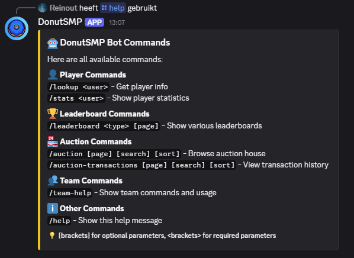

# DonutSMP Discord Bot 

A reliable Discord bot for DonutSMP, built in Rust with Serenity.
Features include player lookups, stats tracking, leaderboards, auction house browsing, simple team management, and automatic updates of your team’s online/offline status and locations.

## Features

- Commands (Discord Interactions)
  - /lookup [user] – player info lookup
  - /stats [user] – detailed player stats
  - /leaderboard [type] [page] – money, kills, deaths, placed/mined blocks, playtime, shards and sell history
  - /auction [page] [search] [sort] – auction house listings
  - /auction-transactions [page] [search] [sort] – recent transactions
  - /team-name [name] – set or view team name
  - /team-add [ign] [country] [skills] [rank] [about] [discord]
  - /team-remove [ign]
  - /team-list – grouped by rank
  - /online – quick online check for team members
  - /help and /team-help – overview and usage
- Periodic team embed in a channel with:
  - Online/offline indicator 
  - Location of online players 

## Requirements

- Rust
- DonutSMP API key

## Quick start

1) Clone the repo and create a .env in the project root:

```env
DISCORD_TOKEN=your_discord_bot_token
DONUTSMP_API_KEY=your_donutsmp_api_key
GUILD_ID=your_discord_server_id
ONLINE_CHANNEL_ID=your_team_channel_id
ONLINE_INTERVAL_MINUTES=10
```

2) Run the bot:

```powershell
cargo run
```

## Examples

<p align="center">
  
</p>

## FAQ

<details>
<summary>How do I enable/disable the periodic team post?</summary>

Set <code>ONLINE_CHANNEL_ID</code> to the target channel ID to enable it. Remove or leave it empty to disable. Interval is controlled by <code>ONLINE_INTERVAL_MINUTES</code> (default 10).

</details>

<details>
<summary>Where is team data stored?</summary>

By default in <code>team_data.json</code> next to the binary. 

</details>

<details>
<summary>Which permissions/scopes does the bot need?</summary>

Invite the bot with the <code>bot</code> and <code>applications.commands</code> scopes. Ensure it can send messages and embed links in the target channels.

</details>

<details>
<summary>Can you extend the bot with extra features?</summary>

Yes — please open an issue in this repository with the requested feature(s) and context.

</details>

